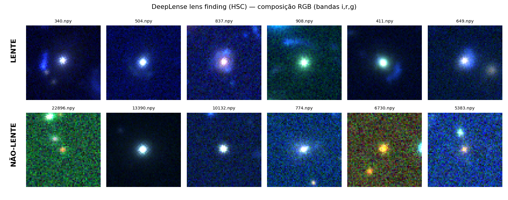

# einstein-rings

**Deep learning detection of strong gravitational lenses in real survey imagery.**


Strong gravitational lensing, in which light from a distant galaxy is bent
around a massive foreground galaxy into arcs and Einstein rings, is one of the
cleanest probes of dark matter and cosmology. Lenses are also extremely rare (~1 in 10³–10⁴ massive
galaxies), and upcoming surveys (Euclid, LSST) will image billions of objects:
visual inspection does not scale. This project builds and evaluates a CNN
classifier for the binary task **lens / non-lens** on real ground-based survey
cutouts, with the class imbalance and purity requirements of a realistic lens
search treated as first-class citizens.

<p align="center">
  
</p>

*Top row: strong lens candidates. Note the faint bluish arcs around the central
galaxy. Bottom row: non-lenses. gri composite, percentile-stretched for display.*

## Data

Real cutouts from the [Hyper Suprime-Cam Subaru Strategic Program](https://hsc-release.mtk.nao.ac.jp/doc/)
(HSC-SSP), as curated for the [DeepLense / ML4SCI](https://github.com/ML4SCI/DeepLense)
lens-finding task:

| split | lenses | non-lenses | ratio  |
|-------|-------:|-----------:|--------|
| train | 1,730  | 28,675     | ~1:17  |
| test  | 195    | 19,455     | ~1:100 |

- One `.npy` file per object, shape `(3, 64, 64)`: photometric bands *g, r, i*
- `float32`, normalized to [0, 1], no NaNs (verified over all ~50k images)
- The severe class imbalance is intrinsic to the problem (lenses are rare) and
  drives every training and evaluation choice below

Download (~2.1 GB): `lens-finding-test.zip`, Google Drive id
`1doUhVoq1-c9pamZVLpvjW1YRDMkKO1Q5`, extracted to `data/raw/`
(a scripted download will be added as the pipeline is built).

> Originally targeted the [Bologna Strong Lens Finding Challenge](http://metcalf1.difa.unibo.it/blf-portal/gg_challenge.html)
> (ground-based track); the portal has been offline since Aug 2026, so the
> project uses the DeepLense HSC data: real observations rather than
> simulations, which is arguably the harder and more interesting regime.

## Method

Roadmap (built incrementally; every step documented in the notebooks):

- [x] Exploratory data analysis: integrity, per-band statistics, duplicate and
      train/test leakage checks, stratified train/validation split
- [ ] Baseline: small CNN trained from scratch with class-weighted loss
- [ ] Main model: ResNet-18 adapted to 3-band input, transfer learning
- [ ] Physically consistent augmentation: n·90° rotations and flips (lensing
      has no preferred orientation)
- [ ] Evaluation: ROC/AUC, precision-recall, and **TPR at low FPR**, the
      metric that matters for surveys, where every false positive costs
      follow-up resources
- [ ] Interpretability: Grad-CAM on true positives and false positives. Does
      the network actually look at the arcs?

## Repository structure

```
notebooks/   analysis notebooks (EDA → baseline → main model)
src/         reusable code (data loading, models, training, viz)
reports/     generated figures
data/        local data, outside version control
```

## Reproducibility

- Python + PyTorch, fixed seeds throughout
- Device-agnostic code (CPU / CUDA); heavy training runs on Colab
- `pip install -r requirements.txt`

## Context

Final project for the Image Processing and Analysis course of the Graduate
Program in Generative AI & LLMs at PUC-Rio. The deliverable notebook
(in Portuguese) doubles as the full written report; this README tracks the
research side of the work.

## References

- Metcalf, R. B., et al. (2019). *The strong gravitational lens finding
  challenge.* A&A 625, A119. [doi:10.1051/0004-6361/201832797](https://doi.org/10.1051/0004-6361/201832797)
- ML4SCI DeepLense project: [github.com/ML4SCI/DeepLense](https://github.com/ML4SCI/DeepLense)
- Aihara, H., et al. (2018). *The Hyper Suprime-Cam SSP Survey: Overview and
  survey design.* PASJ 70, S4. [doi:10.1093/pasj/psx066](https://doi.org/10.1093/pasj/psx066)

## License

[MIT](LICENSE)
